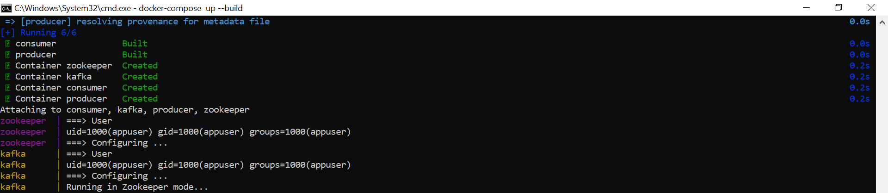
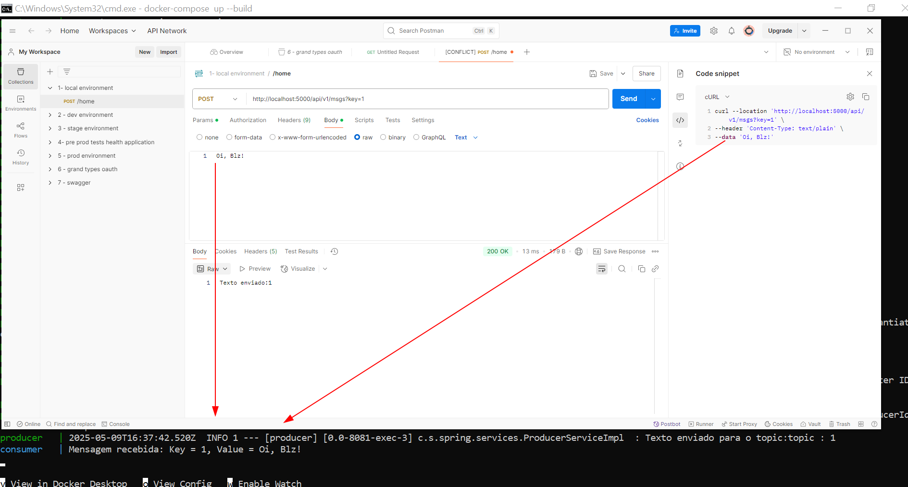
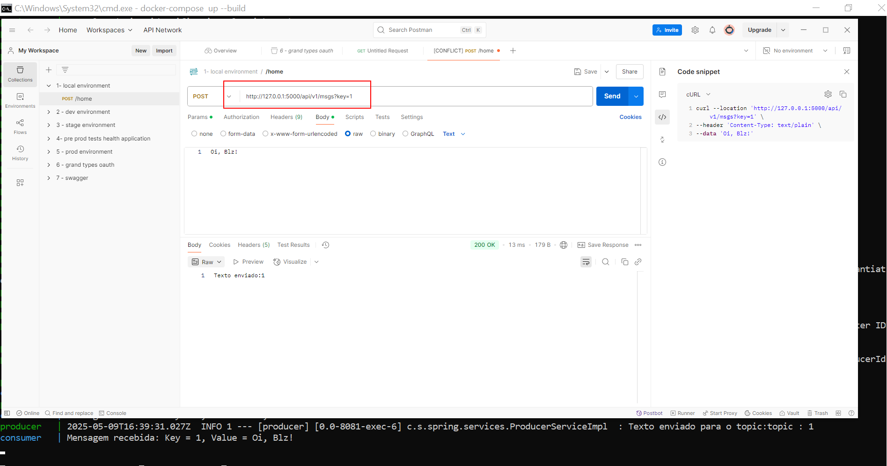

"# Sample-Spring-Broker" 

https://spring.io/projects/

https://www.confluent.io/

https://www.confluent.io/learn/spring-boot-kafka/

https://spring.io/projects/

https://www.confluent.io/


```shell
docker-compose up -build
 => unpacking to docker.io/library/spring-kafka-main-consumer:latest                                                                                                0.5s
 => [producer] resolving provenance for metadata file                                                                                                                  0.0s
 => [consumer] resolving provenance for metadata file                                                                                                                  0.0s
[+] Running 6/6
 ✔ consumer             Built                                                                                                                                          0.0s
 ✔ producer             Built                                                                                                                                          0.0s
 ✔ Container zookeeper  Created                                                                                                                                        0.3s
 ✔ Container kafka      Created                                                                                                                                        0.2s
 ✔ Container consumer   Created                                                                                                                                        0.2s
 ✔ Container producer   Created                                                                                                                                        0.2s
Attaching to consumer, kafka, producer, zookeeper
zookeeper  | ===> User
zookeeper  | uid=1000(appuser) gid=1000(appuser) groups=1000(appuser)
zookeeper  | ===> Configuring ...
kafka      | ===> User
```

````bash
curl --location 'http://localhost:5000/api/v1/msgs?key=1' \
--header 'Content-Type: text/plain' \
--data 'Hey, welcome!'
````



> [!NOTE]
>
> Repositorio com fins de estudos em contexto técnicos, estritamente na área de engenharia de software.

